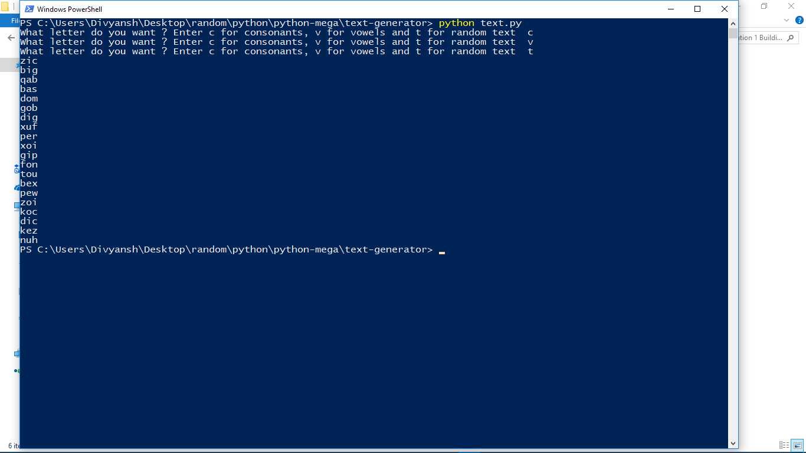

# Text Generator

A command line text generator made in python

## Getting Started
```
* Clone the repo.
* run text.py
```

### Prerequisites

What things you need to install the software and how to install them

```
* Python 3
```

## Built With

* [Python3](https://www.python.org) - The programming language

## Authors

* **Divyansh Dwivedi** - *Initial work*

## Screenshot


